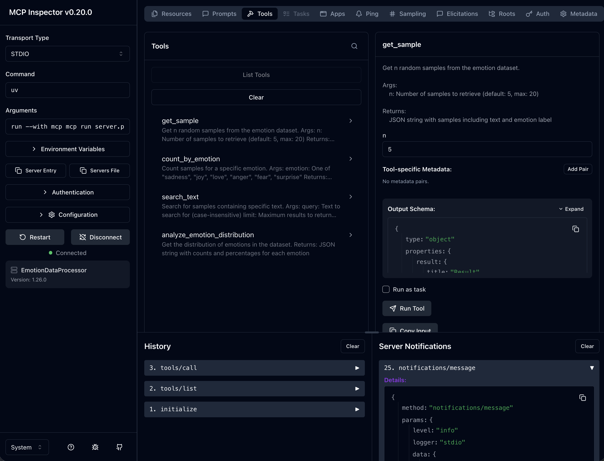

# Assignment 1.5: MCP on HiPerGator

CIS 6930 Data Engineering - Spring 2026

## Overview

This repository contains starter code for the in-class MCP activity on HiPerGator.
You will build an MCP server that processes the `dair-ai/emotion` dataset from Hugging Face.

## Setup on HiPerGator

### 1. Clone this repository

```bash
cd /blue/cis6930/YOUR_GATORLINK
git clone https://github.com/YOUR_USERNAME/cis6930sp26-assignment1.5.git
cd cis6930sp26-assignment1.5
```

### 2. Create environment file

```bash
cp .env.example .env
# Edit .env with your Hugging Face token
```

### 3. Install dependencies

```bash
module load mamba
uv sync
source .venv/bin/activate
```

## Running the MCP Inspector

### Option 1: HiPerGator Desktop (Recommended)

Using HiPerGator Desktop is much easier and avoids SSH tunneling complexity.

1. Go to https://ondemand.rc.ufl.edu
2. Navigate to **Interactive Apps** > **HiPerGator Desktop**
3. Request a session (1 hour, 4 GB memory, 2 CPUs)
4. Once the desktop launches, open a terminal
5. Run:
   ```bash
   cd /blue/cis6930/YOUR_GATORLINK/cis6930sp26-assignment1.5
   module load mamba
   source .venv/bin/activate
   mcp dev server.py
   ```
6. Open Firefox in the virtual desktop and go to `http://localhost:6274`

### Option 2: SSH Tunneling from Your Laptop

If you prefer to use your local browser, you'll need to set up SSH tunneling.

#### Step 1: Start the MCP Inspector on a Compute Node

Run this command to start an interactive job with the MCP inspector:

```bash
ssh hpg "srun --partition=hpg-turin --account=cis6930 --qos=cis6930 \
    --cpus-per-task=4 --ntasks=1 --mem-per-cpu=4gb --time=1:00:00 \
    bash -c 'cd /blue/cis6930/YOUR_GATORLINK/cis6930sp26-assignment1.5 && \
    module load mamba && source .venv/bin/activate && mcp dev server.py'"
```

#### Step 2: Find Your Compute Node Name

In another terminal, find which compute node your job is running on:

```bash
squeue -u $USER
```

Look for the node name in the `NODELIST` column (e.g., `c0702a-s2`).

#### Step 3: Set Up the SSH Tunnel

The MCP Inspector runs on two ports:
- **6274** - Web interface
- **6277** - Proxy server

Open a **new terminal on your laptop** and run:

```bash
ssh -L 6274:localhost:6274 -L 6277:localhost:6277 \
    -J YOUR_GATORLINK@hpg.rc.ufl.edu YOUR_GATORLINK@COMPUTE_NODE
```

**Example:**
```bash
ssh -L 6274:localhost:6274 -L 6277:localhost:6277 \
    -J jsmith@hpg.rc.ufl.edu jsmith@c0702a-s2
```

The `-J` flag (ProxyJump) connects through the login node directly to the compute node.

#### Step 4: Open the Inspector

Open your browser and go to the url that was output by the the dev server. Is should look like `http://localhost:6274/?MCP_PROXY_AUTH_TOKEN=e2a71ba1e83a76dd0ea24fed08b1d62413d5837fbea81cbc41a9233ae169f989` : **http://localhost:6274?MCP_PROXY_AUTH_TOKEN={CODE}**

You should see the MCP Inspector interface:



### Passwordless SSH Login

To avoid entering your password multiple times, set up SSH keys for HiPerGator:
https://docs.rc.ufl.edu/access/ssh_keys/

### Troubleshooting

| Problem | Solution |
|---------|----------|
| "Connection refused" | Ensure you're using `-J` (ProxyJump) and forwarding both ports (6274 and 6277) |
| "Address already in use" | Kill processes: `lsof -ti:6274 | xargs kill -9` |
| Host key verification failed | Add `-o StrictHostKeyChecking=no` to the SSH command |
| Page won't load | Verify `mcp dev` is still running on the compute node |

## Using the MCP Inspector

1. Click the **Tools** tab in the left sidebar
2. Select a tool from the list (e.g., `get_sample`)
3. Fill in the parameter values
4. Click **Run Tool**
5. View the JSON response in the output panel

### Tools to Test

| Tool | Parameters |
|------|------------|
| `get_sample` | `n: 3` |
| `count_by_emotion` | `emotion: "joy"` |
| `search_text` | `query: "happy"`, `limit: 5` |
| `analyze_emotion_distribution` | (no parameters) |

## Dataset

The [dair-ai/emotion](https://huggingface.co/datasets/dair-ai/emotion) dataset contains English Twitter messages labeled with six emotions:

| Label | Emotion |
|-------|---------|
| 0 | sadness |
| 1 | joy |
| 2 | love |
| 3 | anger |
| 4 | fear |
| 5 | surprise |

## Submission

After completing the activity, submit to Canvas:
1. Your `outputs.txt` file with tool outputs
2. A brief reflection (2-3 sentences)

## Resources

- [MCP Python SDK](https://github.com/modelcontextprotocol/python-sdk)
- [Hugging Face Datasets](https://huggingface.co/docs/datasets/)
- [HiPerGator Documentation](https://help.rc.ufl.edu/)
- [HiPerGator SSH Keys](https://docs.rc.ufl.edu/access/ssh_keys/)
